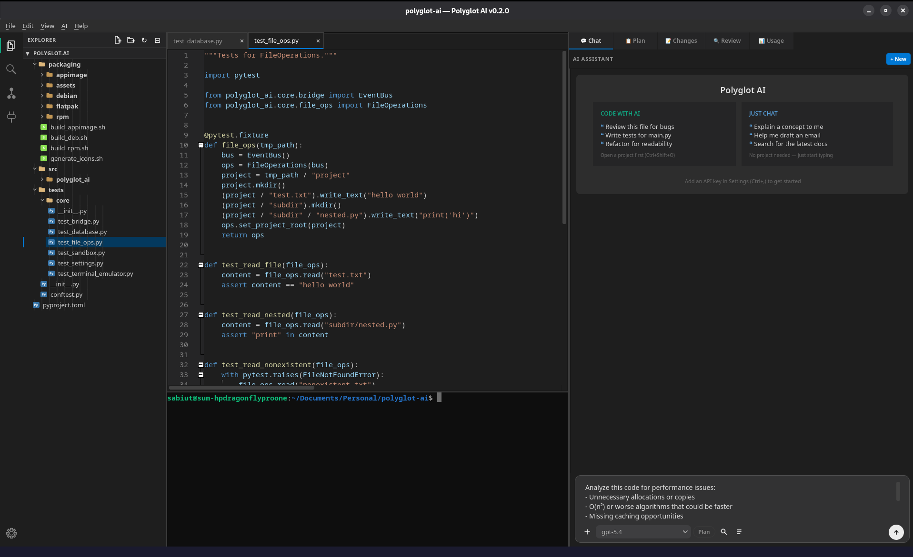

# Polyglot AI

AI-powered coding assistant for Linux — multi-provider desktop IDE with OpenAI, Anthropic, Google, and DeepSeek support.



## Features

### Core
- **Multi-provider AI chat** — OpenAI, Anthropic (Claude), Google (Gemini), DeepSeek with streaming responses
- **Integrated code editor** — Syntax highlighting via QScintilla, multi-tab editing
- **Built-in terminal** — Full PTY terminal with mouse text selection, copy/paste, and right-click context menu
- **AI tool calling** — File read/write/search, shell execution, git operations
- **Command palette** — Quick actions with Ctrl+Shift+P
- **Plan mode** — Structured step-by-step development plans
- **Prompt templates** — Built-in templates for code review, debugging, refactoring
- **RAG indexing** — TF-IDF project indexer for context-aware responses
- **Inline completions** — AI-powered code suggestions
- **Token usage dashboard** — Track costs across providers
- **Session restore & branching** — Save workspace state, fork conversations

### Workflows
- **12 built-in workflows** — Repeatable multi-step AI automations in YAML
- **QA & Testing** — verify-deploy, reproduce-bug, record-test, record-test-interactive
- **Record Test Interactive** — Click through a site while Playwright records, AI hardens the code with 10 rules (resilient selectors, smart waits, assertions), auto-validates and fixes failures up to 3x
- **DevOps** — infra-health-check, incident-response, pre-deploy-check, resource-optimization
- **Security & Database** — security-audit, db-migration-check
- **Build Infrastructure** — Architecture-first infra copilot: analyze project → propose architecture → generate Terraform → CI/CD → validate → plan → deploy
- **Custom workflows** — Create your own in `.polyglot/workflows/` with YAML
- **Autonomous execution** — Workflows run without asking permission; the user approved by launching

### Code review
- **Diff review** — AI-powered review of working changes, staged changes, or branch-vs-main
- **IaC security scans** — One-click security reviews for:
  - 🔍 Terraform (`.tf`, `.tfvars`, `.hcl`)
  - 🔍 Kubernetes manifests (real YAML parsing, not substring matching)
  - 🔍 Dockerfiles and Docker Compose
  - 🔍 Helm charts (Chart.yaml, values.yaml, templates)
  - 🎨 Frontend Design Audit
- **Structured findings** — Severity, category, file:line, suggested fix
- **Copy results** — 📋 Export full review as formatted Markdown

### DevOps panels
- **Git panel** — Branch view, staging, commits
- **CI/CD panel** — GitHub Actions workflow runs, job status, live log streaming
- **Docker panel** — Containers, images, logs, start/stop/restart/remove with approval
- **Kubernetes panel** — Pods, deployments, services, logs, scale/delete/apply with approval
- **Database panel** — Direct PostgreSQL / MySQL / SQLite connections with schema explorer and SQL runner

### MCP (Model Context Protocol)
- **Built-in MCP marketplace** — One-click install of Filesystem, Git, Memory, GitHub, Fetch, Sequential Thinking, Playwright, GitLab, MySQL, and more
- **Smart defaults** — On first run, Polyglot AI auto-seeds `sequential-thinking`, `memory`, and `fetch` (no-auth) so deep reasoning works out of the box
- **MCP sidebar** — Live connection status, tool counts, inline connect/disconnect, search filter
- **Sequential-thinking integration** — When the tool is available, the AI is prompted to reason step-by-step on complex tasks

## Documentation

Full documentation is available on the **[Polyglot AI Wiki](https://github.com/sabiut/polyglot-ai/wiki)** — getting started, chat, workflows, MCP servers, review, DevOps panels, settings, and more.

## Install

### From release (recommended)

Download the latest release from [Releases](https://github.com/sabiut/polyglot-ai/releases):

| Format | Platform | Install |
|--------|----------|---------|
| `.deb` | Ubuntu/Debian | `sudo dpkg -i polyglot-ai_*.deb` |
| `.rpm` | Fedora/RHEL | `sudo rpm -i polyglot-ai-*.rpm` |
| `.AppImage` | Any Linux | `chmod +x Polyglot_AI-*.AppImage && ./Polyglot_AI-*.AppImage` |
| `.whl` | pip (pipx recommended) | `pipx install polyglot_ai-*.whl` |

> **Note on the wheel install:** modern distros (Ubuntu 23.04+, Fedora 38+,
> Debian 12+) ship Python with PEP 668's `externally-managed-environment`
> marker, so a bare `pip install` errors with a hint to use a venv or
> [`pipx`](https://pipx.pypa.io/). `pipx` is the friendliest path — it
> isolates the install in its own venv and adds `polyglot-ai` to your
> `PATH` automatically.

### From source

```bash
git clone https://github.com/sabiut/polyglot-ai.git
cd polyglot-ai
python3 -m venv .venv
source .venv/bin/activate
pip install -e ".[dev]"
polyglot-ai
```

### With Nix (devshell)

If you have [Nix](https://nixos.org/download.html) with flakes enabled,
you don't need to install Python, Qt, or any system libraries manually:

```bash
git clone https://github.com/sabiut/polyglot-ai.git
cd polyglot-ai
nix develop          # drops you into a shell with everything ready
polyglot-ai          # launches the app
```

The first `nix develop` creates a `.venv` and runs `pip install -e ".[dev]"`
inside it, using Qt6 / asyncpg / aiomysql from nixpkgs and the rest from
PyPI. Subsequent shells reuse the venv. If you use [direnv](https://direnv.net)
with [nix-direnv](https://github.com/nix-community/nix-direnv), the shell
auto-activates on `cd` thanks to the included `.envrc`.

## Configuration

1. Launch the app and open **Settings** (gear icon)
2. Add your API key for at least one provider:
   - OpenAI API key
   - Anthropic API key
   - Google AI API key
   - DeepSeek API key
3. Or sign in with your existing subscription (OpenAI/Claude)

## Requirements

### Core
- Python 3.11+
- Linux (X11 or Wayland)
- Qt 6.6+

### Optional runtimes for MCP servers
Most MCP servers are distributed as Node.js or Python packages. Install whichever runtimes you need for the servers you want to use:

| Runtime | Install | Used by |
|---|---|---|
| **Node.js 20+** (`npx`) | [nodejs.org](https://nodejs.org/) or `sudo apt install nodejs npm` | sequential-thinking, memory, filesystem, github, gitlab, playwright, mysql |
| **uv** (`uvx`) | `curl -LsSf https://astral.sh/uv/install.sh \| sh` | fetch, git |

If either runtime is missing, the corresponding MCP servers simply fail to connect — the rest still work. The three defaults seeded on first run (`sequential-thinking`, `memory`, `fetch`) require both `npx` and `uvx`.

### Optional CLIs for DevOps panels
These are only needed if you want to use the corresponding panel:

| Tool | Install | Panel |
|---|---|---|
| `git` | system package | Git panel, CI/CD panel |
| `gh` (GitHub CLI) | [cli.github.com](https://cli.github.com/) | CI/CD panel (GitHub Actions) |
| `docker` | [docs.docker.com](https://docs.docker.com/engine/install/) | Docker panel |
| `kubectl` | [kubernetes.io/docs/tasks/tools](https://kubernetes.io/docs/tasks/tools/) | Kubernetes panel |
| `arduino-cli` | [arduino.github.io/arduino-cli](https://arduino.github.io/arduino-cli/latest/installation/) | Arduino panel (C++ build & upload) |
| `mpremote` | `pip install --user mpremote` | Arduino panel (MicroPython upload) |

## Linux notes

- **GNOME on Wayland — system tray icon won't appear** unless the
  AppIndicator extension is installed and enabled. The app runs
  normally either way; only the tray icon is affected. Install with:

  ```bash
  sudo apt install gnome-shell-extension-appindicator   # Debian/Ubuntu
  sudo dnf install gnome-shell-extension-appindicator   # Fedora
  ```

  Then enable it in the GNOME *Extensions* app and log out / back in.

- **Arduino uploads need `dialout` group membership** — without it,
  flashing a board fails with a permission-denied error on `/dev/ttyUSB*`.

  ```bash
  sudo usermod -aG dialout $USER
  # then log out and back in
  ```

- **AppImage on Ubuntu 22.04+ / Fedora 36+** needs `libfuse2`
  (or `fuse-libs` on Fedora) since modern distros no longer ship it
  by default. See [packaging/INSTALL.md](packaging/INSTALL.md) for the
  full distro-specific guide.

## License

LGPL-3.0-or-later
